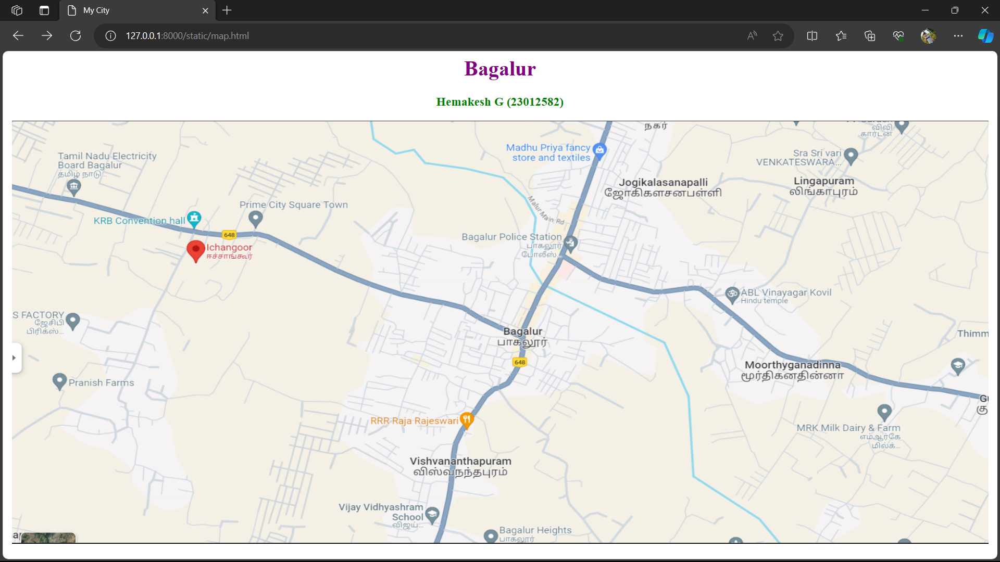
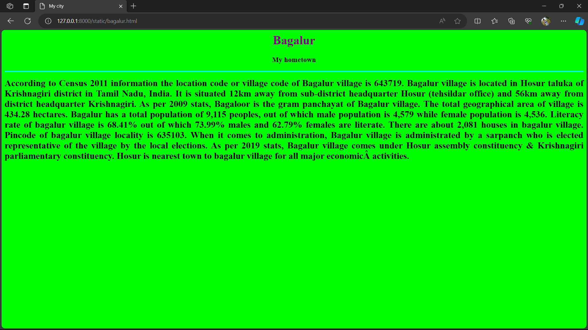
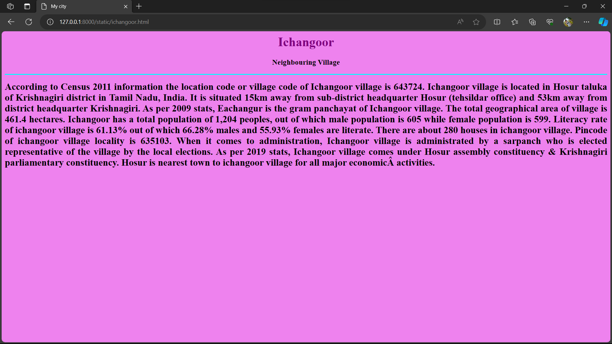
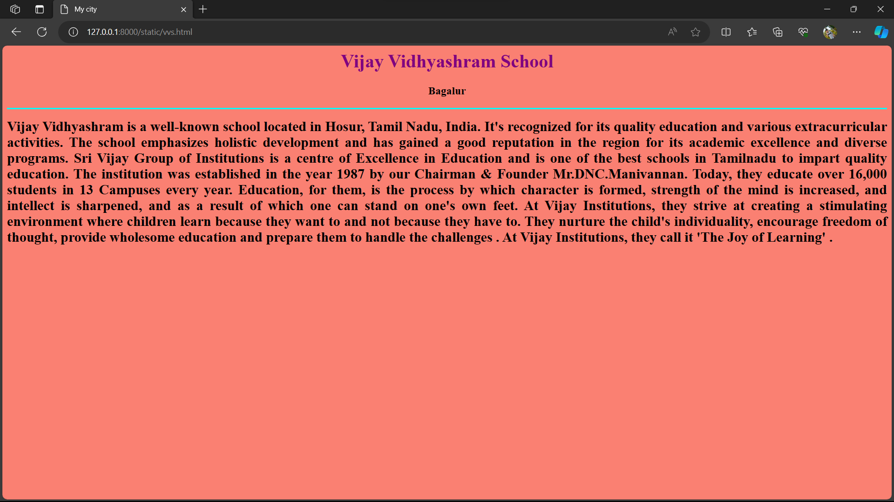
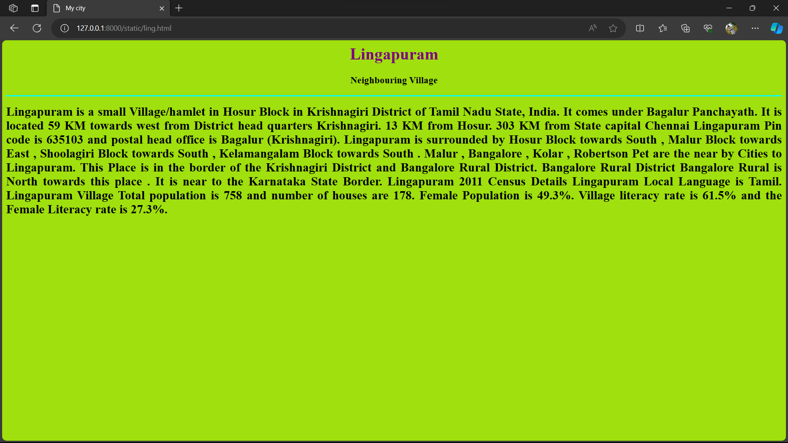
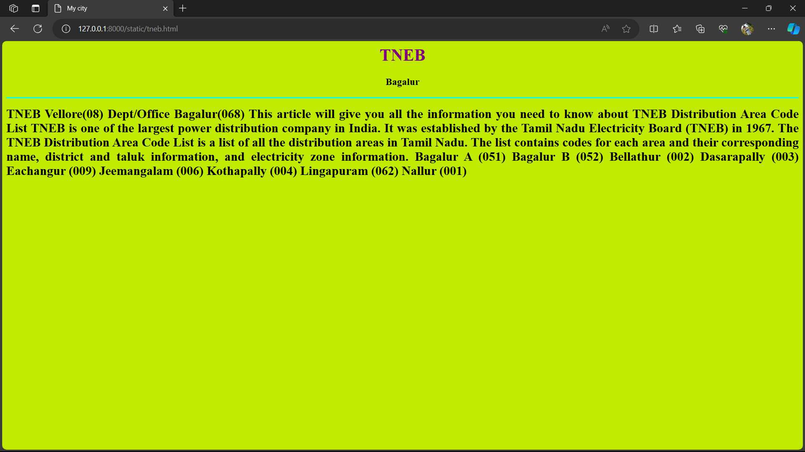

# Ex04 Places Around Me
## Date: 20.11.2023

## AIM
To develop a website to display details about the places around my house.

## DESIGN STEPS

### STEP 1
Create a Django admin interface.

### STEP 2
Download your city map from Google.

### STEP 3
Using ```<map>``` tag name the map.

### STEP 4
Create clickable regions in the image using ```<area>``` tag.

### STEP 5
Write HTML programs for all the regions identified.

### STEP 6
Execute the programs and publish them.

## CODE
```

map.html

<html>
<head>
<title>My City</title>
</head>
<body>
<h1 align="center">
<font color="purple"><b>Bagalur</b></font>
</h1>
<h3 align="center">
<font color="green"><b>Hemakesh G (23012582)</b></font>
</h3>
<center>

<map name="MyCity">
<area shape="rect" coords="600,200,1000,400" href="bagalur.html" title="Bagalur">
<area shape="rect" coords="500,540,700,640" href="vvs.html" title="Vijay Vidyashram School">
<area shape="circle" coords="100,140,100" href="tneb.html" title="TNEB Bagalur">
<area shape="circle" coords="300,200,100" href="ichangoor.html" title="Ichangoor">
<area shape="rect" coords="1200,60,1350,200" href="ling.html" title="Lingapuram">
</map>
</center>
</body>
</html>

bagalur.html

<html>
    <head>
        <title>My city</title>
    </head>
    <body bgcolor="lime">
        <h1 align="center">
            <font color="purple"><b>Bagalur</font>
        </h1>
        <h3 align="center">
            <font color="black"><b>My hometown</b></font>
        </h3>
        <hr size="3" color="cyan">
        <p align="justify">
            <font face="calibra" size="5">
                According to Census 2011 information the location code or village code of Bagalur village is 643719. Bagalur village is located in Hosur taluka of Krishnagiri district in Tamil Nadu, India. It is situated 12km away from sub-district headquarter Hosur (tehsildar office) and 56km away from district headquarter Krishnagiri. As per 2009 stats, Bagaloor is the gram panchayat of Bagalur village.
                The total geographical area of village is 434.28 hectares. Bagalur has a total population of 9,115 peoples, out of which male population is 4,579 while female population is 4,536. Literacy rate of bagalur village is 68.41% out of which 73.99% males and 62.79% females are literate. There are about 2,081 houses in bagalur village. Pincode of bagalur village locality is 635103.
                When it comes to administration, Bagalur village is administrated by a sarpanch who is elected representative of the village by the local elections. As per 2019 stats, Bagalur village comes under Hosur assembly constituency & Krishnagiri parliamentary constituency. Hosur is nearest town to bagalur village for all major economic activities.
            </font> 
        </p>   
</html>

ichangoor.html

<html>
    <head>
        <title>My city</title>
    </head>
    <body bgcolor="violet">
        <h1 align="center">
            <font color="purple"><b>Ichangoor</font>
        </h1>
        <h3 align="center">
            <font color="black"><b>Neighbouring Village</b></font>
        </h3>
        <hr size="3" color="cyan">
        <p align="justify">
            <font face="calibra" size="5">
                According to Census 2011 information the location code or village code of Ichangoor village is 643724.
                 Ichangoor village is located in Hosur taluka of Krishnagiri district in Tamil Nadu, India.
                  It is situated 15km away from sub-district headquarter Hosur (tehsildar office) and 53km away from district headquarter Krishnagiri.
                 As per 2009 stats, Eachangur is the gram panchayat of Ichangoor village.
                 The total geographical area of village is 461.4 hectares. 
                 Ichangoor has a total population of 1,204 peoples, out of which male population is 605 while female population is 599.
                 Literacy rate of ichangoor village is 61.13% out of which 66.28% males and 55.93% females are literate.
                 There are about 280 houses in ichangoor village.
                 Pincode of ichangoor village locality is 635103.
                 When it comes to administration, Ichangoor village is administrated by a sarpanch who is elected representative of the village by the local elections.
                 As per 2019 stats, Ichangoor village comes under Hosur assembly constituency & Krishnagiri parliamentary constituency.
                 Hosur is nearest town to ichangoor village for all major economic activities.
            </font> 
        </p>  
</html>

vvs.html

<html>
    <head>
        <title>My city</title>
    </head>
    <body bgcolor="salmon">
        <h1 align="center">
            <font color="purple"><b>Vijay Vidhyashram School</font>
        </h1>
        <h3 align="center">
            <font color="black"><b>Bagalur</b></font>
        </h3>
        <hr size="3" color="cyan">
        <p align="justify">
            <font face="calibra" size="5">
                Vijay Vidhyashram is a well-known school located in Hosur, Tamil Nadu, India.
                It's recognized for its quality education and various extracurricular activities. 
                The school emphasizes holistic development and has gained a good reputation in the region for its academic excellence and diverse programs.   
                Sri Vijay Group of Institutions is a centre of Excellence in Education and is one of the best schools in Tamilnadu to impart quality education. The institution was established in the year 1987 by our Chairman & Founder Mr.DNC.Manivannan.
                 Today, they educate over 16,000 students in 13 Campuses every year.
Education, for them, is the process by which character is formed, strength of the mind is increased, and intellect is sharpened, and as a result of which one can stand on one's own feet.
At Vijay Institutions, they strive at creating a stimulating environment where children learn because they want to and not because they have to.
They nurture the child's individuality, encourage freedom of thought, provide wholesome education and prepare them to handle the challenges .
At Vijay Institutions, they call it 'The Joy of Learning'  .
            </font> 
        </p>    
</html>

ling.html

<html>
    <head>
        <title>My city</title>
    </head>
    <body bgcolor="tangerine">
        <h1 align="center">
            <font color="purple"><b>Lingapuram</font>
        </h1>
        <h3 align="center">
            <font color="black"><b>Neighbouring Village</b></font>
        </h3>
        <hr size="3" color="cyan">
        <p align="justify">
            <font face="calibra" size="5">
                 Lingapuram is a small Village/hamlet in Hosur Block in Krishnagiri District of Tamil Nadu State, India.
                 It comes under Bagalur Panchayath.
                 It is located 59 KM towards west from District head quarters Krishnagiri. 13 KM from Hosur.
                 303 KM from State capital Chennai
                 Lingapuram Pin code is 635103 and postal head office is Bagalur (Krishnagiri).
                 Lingapuram is surrounded by Hosur Block towards South , Malur Block towards East , Shoolagiri Block towards South , Kelamangalam Block towards South .
                 Malur , Bangalore , Kolar , Robertson Pet are the near by Cities to Lingapuram.
                 This Place is in the border of the Krishnagiri District and Bangalore Rural District.
                 Bangalore Rural District Bangalore Rural is North towards this place .
                 It is near to the Karnataka State Border.
                 Lingapuram 2011 Census Details
                 Lingapuram Local Language is Tamil.
                 Lingapuram Village Total population is 758 and number of houses are 178.
                 Female Population is 49.3%.
                 Village literacy rate is 61.5% and the Female Literacy rate is 27.3%.
            </font> 
        </p>

       

     
</html>

tneb.html

<html>
    <head>
        <title>My city</title>
    </head>
    <body bgcolor="cream">
        <h1 align="center">
            <font color="purple"><b>TNEB</font>
        </h1>
        <h3 align="center">
            <font color="black"><b>Bagalur</b></font>
        </h3>
        <hr size="3" color="cyan">
        <p align="justify">
            <font face="calibra" size="5">
                TNEB Vellore(08) Dept/Office Bagalur(068)
This article will give you all the information you need to know about TNEB Distribution Area Code List
TNEB is one of the largest power distribution company in India.
 It was established by the Tamil Nadu Electricity Board (TNEB) in 1967.
The TNEB Distribution Area Code List is a list of all the distribution areas in Tamil Nadu.
 The list contains codes for each area and their corresponding name, district and taluk information, and electricity zone information.
 Bagalur A (051)
Bagalur B (052)
Bellathur  (002)
Dasarapally (003)
Eachangur (009)
Jeemangalam (006)
Kothapally (004)
Lingapuram (062)
Nallur (001)
            </font> 
        </p>

       

     
</html>


```


## OUTPUT








## RESULT
The program for implementing image maps using HTML is executed successfully.
